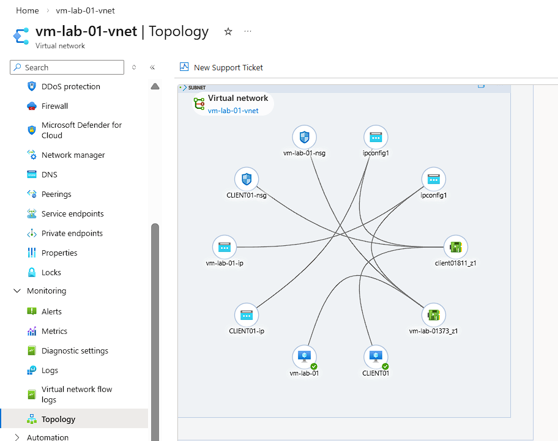
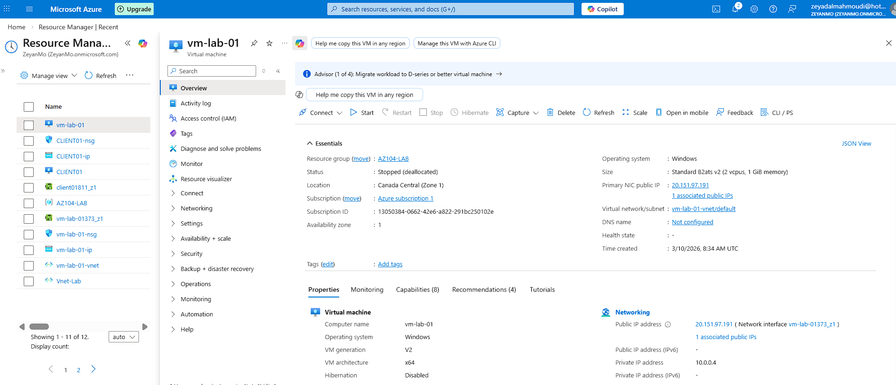
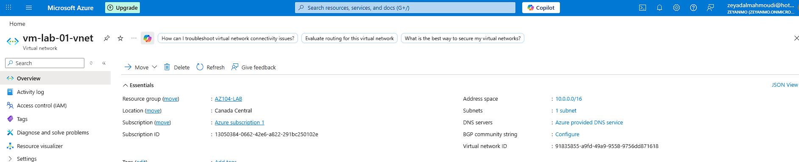
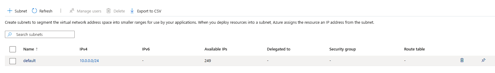
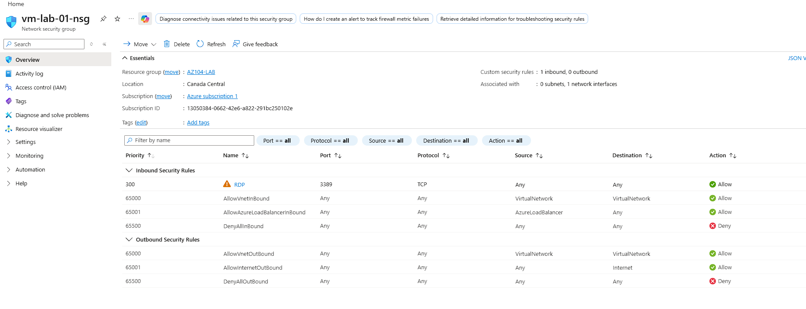
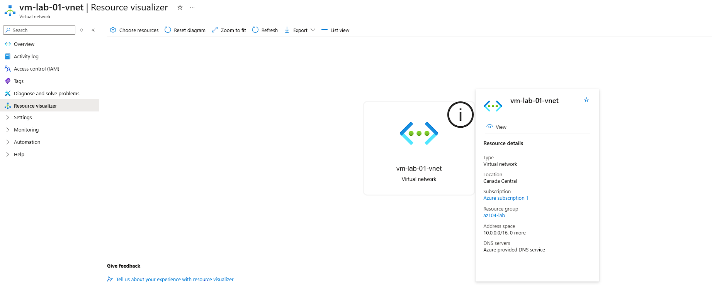

# Azure Active Directory Domain Lab

## Overview
This lab demonstrates the deployment of a Windows Server Domain Controller and a Windows client within Microsoft Azure.

The client machine is joined to the Active Directory domain hosted on the Domain Controller.

This project documents the Azure infrastructure, networking, and automation used to build a small enterprise-style Active Directory lab environment.

---

## Architecture Diagram

---

## Lab Infrastructure

**Virtual Network**  
`vm-lab-01-vnet`

**Address Space**  
`10.0.0.0/16`

**Subnet**  
`10.0.0.0/24`

### Virtual Machines
- **vm-lab-01** – Windows Server Domain Controller
- **CLIENT01** – Windows client joined to the domain

### Azure Components
- Network Security Groups
- Public IP addresses
- Network Interfaces
- Azure Virtual Network topology view

---

## Deployment Summary

### 1. Azure Resources
Azure resources were created in the lab resource group to support the domain environment.

### 2. Domain Controller Deployment
A Windows Server virtual machine was deployed and configured as the Domain Controller.

### 3. Client Deployment
A Windows client virtual machine was deployed and joined to the Active Directory domain.

### 4. Networking
The environment uses an Azure Virtual Network, subnet configuration, public IP addressing, and Network Security Groups for connectivity and access control.

---

## Azure Infrastructure Screenshots

### Azure VM Overview

### Virtual Network Overview

### Subnet Configuration

### Network Security Group Rules

### Resource Visualizer

### Network Topology

---

## Automation Scripts

PowerShell scripts used during the lab setup are included in the `scripts` folder.

- `install-ad-ds.ps1` – Installs Active Directory Domain Services and promotes the server to a Domain Controller
- `join-domain.ps1` – Joins the Windows client machine to the Active Directory domain

---

## Skills Demonstrated

- Azure Virtual Machine deployment
- Azure Virtual Network configuration
- Azure Network Security Groups
- Active Directory Domain Services
- Domain joining Windows clients
- PowerShell automation
- Azure infrastructure topology documentation

---

## Future Improvements

Possible improvements to this lab environment:

- Deploy a second Domain Controller
- Configure Azure Bastion instead of public RDP
- Implement VPN connectivity
- Automate infrastructure deployment using Azure Bicep templates
- Add Group Policy configuration and OU design
